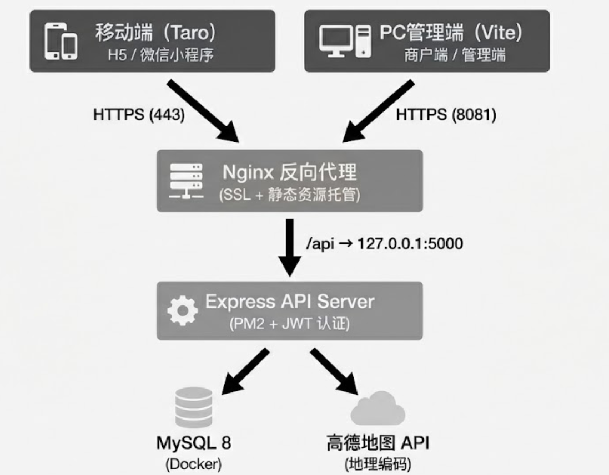

# 易宿酒店预订平台 — 项目汇报文稿

> 第五期携程前端训练营大作业
> 成员：冯俊财 ⻩彬健

---

## 一、项目概述

### 1.1 项目背景

随着在线旅游市场的快速发展，酒店预订已成为用户出行的核心需求之一。本项目以携程酒店业务为参考，设计并实现了一套酒店预订平台——**易宿**，涵盖用户端酒店搜索预订（移动端）和商户/管理员端的酒店管理系统（PC端）。

### 1.2 项目定位

本平台围绕三类核心角色展开：

| 角色 | 使用端 | 核心功能 |
|------|--------|----------|
| **用户（User）** | 移动端 | 搜索酒店、浏览详情 |
| **商户（Merchant）** | PC管理端 | 录入酒店信息、管理房型、查看审核状态 |
| **管理员（Admin）** | PC管理端 | 审核酒店、管理上下线 |

### 1.3 项目结构

```
├── mobile/          # 移动端（用户端）— Taro + React
│   ├── pages/           # 首页 / 列表 / 详情
│   ├── components/      # 日历组件 / 价格滑块
│   ├── services/        # API 服务层
│   └── utils/           # 工具函数
│
├── management/      # PC管理端 — React + Vite + Ant Design
│   ├── pages/           # 登录注册 / 商户仪表盘 / 审核管理
│   ├── components/      # 路由守卫 / 侧边栏 / 头部
│   ├── services/        # 统一 API 客户端
│   └── router/          # 路由配置
│
├── server/          # 后端服务 — Node.js + Express + MySQL
│   ├── controllers/     # 业务控制器
│   ├── models/          # 数据模型
│   ├── routes/          # API 路由
│   ├── middlewares/     # JWT 认证中间件
│   └── services/        # 高德地图服务
│
└── docker-compose.yml   # 数据库容器化部署
```

---

## 二、技术架构

### 2.1 技术栈总览

| 层级 | 技术选型 | 说明 |
|------|----------|------|
| 移动端 | React 18 + Taro 4 + Sass | 支持 H5、微信小程序、支付宝小程序等多端 |
| PC管理端 | React 18 + Vite 5 + Ant Design 5 + Less | 企业级后台管理界面 |
| 后端服务 | Node.js 18 + Express 4 | RESTful API 服务 |
| 数据库 | MySQL 8 | 关系型数据存储，支持全文检索 |
| 认证 | JWT + bcrypt | 无状态令牌认证 + 密码加密 |
| 地图服务 | 高德地图 Web API | 地理编码、距离计算、POI 搜索 |
| 部署 | Docker Compose | MySQL + Adminer 一键部署 |

### 2.2 系统架构图

<div align="center">
  
</div>

---

## 三、数据库设计

### 3.1 数据表结构

本系统包含 **7 张核心数据表**，覆盖酒店管理、房型管理和标签体系：

| 数据表 | 说明 | 关键字段 |
|--------|------|----------|
| `merchant` | 商户账号 | merchant_id, merchant_name, business_license, status |
| `admin` | 管理员 | admin_id, username, password |
| `hotel` | 酒店信息 | hotel_id, hotel_name, city, address, hotel_level, price_start, audit_status, publish_status |
| `room_type` | 房型字典 | type_id, type_name |
| `hotel_room` | 酒店房间 | room_id, hotel_id, room_type_id, price, room_count |
| `tag` | 标签/设施 | tag_id, tag_name |
| `hotel_tag_relation` | 酒店-标签关联 | hotel_id, tag_id（多对多） |

### 3.2 核心关系

```
merchant (1) ──→ (N) hotel
hotel    (1) ──→ (N) hotel_room
hotel    (M) ←──→ (N) tag         [通过 hotel_tag_relation]
```

### 3.3 设计亮点

- **全文检索索引**：hotel 表的 `hotel_name`、`hotel_address`、`city` 字段建立 FULLTEXT 索引（ngram 解析器），支持中文模糊搜索
- **审核状态追踪**：`audit_status` + `publish_status` 双字段控制酒店上线流程，`reject_reason` 记录驳回原因
- **标签体系**：通过多对多关联表实现灵活的酒店设施/特色标签管理

---

## 四、功能模块详解

### 4.1 移动端 — 用户端

#### 4.1.1 首页（酒店查询页）

首页是用户搜索酒店的入口，提供丰富的筛选条件：

**核心功能：**
- **城市选择**：支持国内/海外双分类，涵盖 60+ 城市。
- **自定义日历组件**：12 个月可滚动日历，支持入住/离店日期范围选择，自动计算住宿天数
- **价格区间滑块**：双滑块拖拽选择价格范围（0-2000+），支持触摸事件
- **快捷标签筛选**：从后端动态获取热门标签（WiFi、泳池、健身房等）
- **星级筛选**：0-5 星级选择
- **定位功能**：集成高德地图 API 自动获取用户所在城市
- **Banner 轮播**：展示推荐酒店图片

**技术要点：**
- 凌晨时段（0:00-6:00）特殊处理：自动将入住日期设为前一天
- 防抖搜索（200ms），避免频繁请求

#### 4.1.2 酒店列表页 

展示搜索结果，支持多维度筛选和排序：

**核心功能：**
- **多条件筛选组合**：城市 + 关键词 + 价格区间 + 星级 + 标签
- **多种排序方式**：综合排序、价格升/降、评分升/降、距离远/近
- **上拉加载更多**：分页加载（每页 10 条），ScrollView 无限滚动
- **筛选编辑面板**：可展开修改搜索条件，采用「草稿-确认」模式避免误操作
- **酒店卡片展示**：图片、名称、星级、评分、地址、标签、价格

**技术要点：**
- 草稿模式（Draft Pattern）：编辑面板修改参数不立即生效，点击确认后才触发搜索
- ScrollView 动态高度计算，适配不同屏幕尺寸
- 标签缓存至 LocalStorage，减少重复请求

#### 4.1.3 酒店详情页 

展示酒店完整信息并引导用户预订：

**核心功能：**
- **图片轮播**：沉浸式 Banner 轮播，显示当前图片序号
- **三 Tab 信息展示**：概览 / 设施 / 政策
- **房型价格列表**：展示各房型的价格、面积、楼层、床型、早餐、取消政策等
- **预订信息栏**：入住/离店日期、住客人数、房间数
- **底部固定预订按钮**：显示最低价格，引导下单
- **下拉刷新**：支持页面刷新获取最新数据

**技术要点：**
- 智能字段映射：兼容不同 API 返回格式
- 图片降级策略：无图时使用默认占位图，每个酒店使用唯一 lock ID 保证占位图一致性
- URL 参数 + LocalStorage 双重数据源，确保页面跳转数据不丢失

---

### 4.2 PC管理端

#### 4.2.1 登录/注册模块 

**核心功能：**
- 统一登录入口，支持商户和管理员两种角色
- 注册时选择角色（商户/管理员）
- 登录成功后将 token、角色信息存入 LocalStorage
- 根据角色自动跳转至对应仪表盘

**技术要点：**
- 基于 Ant Design Form 的表单验证
- JWT Token 本地持久化
- 角色路由自动分发：商户 → `/merchant/dashboard`，管理员 → `/admin/dashboard`

#### 4.2.2 路由守卫（PrivateRoute）

**核心功能：**
- Token 有效性检查：未登录用户自动跳转登录页
- 角色权限校验：商户无法访问管理员页面，反之亦然
- 非法访问时根据角色重定向至对应默认页

**路由结构：**
```
/login              → 登录页（公开）
/register           → 注册页（公开）
/merchant/dashboard → 商户仪表盘（需 merchant 角色）
  /new              → 新增酒店
  /edit/:hotel_id   → 编辑酒店
/admin/dashboard    → 审核管理（需 admin 角色）
```

#### 4.2.3 商户仪表盘 

**核心功能：**
- 以表格形式展示商户旗下所有酒店
- 显示字段：酒店名称、城市、地址、星级、房间数、起步价、审核状态、发布状态、创建时间
- 快捷操作：新增酒店、编辑酒店信息

**技术要点：**
- Ant Design Table 配置化列定义
- 审核状态/发布状态标签化展示

#### 4.2.4 酒店信息录入/编辑 （含房型管理）

**整体设计思路：**

酒店创建表单采用多步骤分页设计，将「酒店基本信息」拆分为独立步骤，由顶部进度条（Steps）指示当前位置。用户在最后一步点击提交时，系统一次性收集所有步骤的数据统一发送，而不是每步单独提交。

**新增酒店表单：**
- 酒店名称、城市选择（20+ 城市下拉）、详细地址
- 星级评定（1-5 星 Rate 组件）
- 联系电话、酒店描述
- 设施标签多选（从后端动态获取）
- 酒店图片上传（最多 5 张，支持预览）

**编辑酒店：**
- Tab 切换：酒店信息 / 房型管理
- 查看/编辑模式切换
- 使用 Promise.all 并行加载酒店信息、酒店标签、标签列表
- 提交时聚合酒店信息 + 所有房型数据统一提交

**房型管理：**
- 可编辑 Tab 页签：每个 Tab 对应一个房型
- 动态增删房型
- 每个房型独立表单：价格、数量、房型选择（下拉）、图片上传
- useRef 管理多个表单实例引用

**数据收集机制：**

表单数据分为两个层次：
- **酒店信息层**：由 Ant Design 的 `Form` 组件统一托管，表单实例通过 `Form.useForm()` 在顶层组件中创建并向下传递给各子表单组件。子组件直接使用同一个 form 实例注册字段，提交时只需调用一次 `form.getFieldsValue()` 即可取回全部酒店字段。
- **房间信息层**：支持多个房间同时填写，每个房间是一个独立的子表单实例。父组件通过 `useRef` 维护一个映射表（`roomFormsRef`），每个房间子组件挂载时将自身的表单实例注册进去，卸载时移除。提交时遍历映射表，批量调用每个子表单的 `getFieldsValue()` 取回所有房间数据。

**提交前数据清洗：**

前端在提交前将所有值为 `undefined` 的字段替换为 `null`，以与 MySQL 行为保持一致——MySQL 对允许为空的字段期望收到 `NULL`，而 JavaScript 中未填写的表单项默认为 `undefined`，直接提交会导致参数缺失错误。最终提交的数据结构是酒店对象与房间数组合并后的完整 JSON 对象，由后端统一接收处理。

#### 4.2.5 审核管理 （含详情）

**审核列表：**
- 待审核酒店队列表格展示
- 列字段：酒店ID、名称、联系电话、提交时间、审核状态、操作
- 状态筛选：全部 / 待审核 / 已通过 / 已驳回
- 审核操作：通过 / 驳回（弹窗确认，驳回需填写原因）
- 操作后自动刷新列表

**审核详情：**
- 只读模式展示酒店完整信息
- Tab 分组：基本信息 / 房型信息
- 使用 Ant Design Descriptions 组件展示详情
- 标签格式化显示

---

### 4.3 后端服务

#### 4.3.1 认证系统

- **多角色登录**：同时查询 user、merchant、admin 三张表（Promise.all 并行查询）
- **密码安全**：bcrypt 加密（10 轮盐值）
- **JWT 令牌**：登录成功后签发 token，包含用户 ID 和角色信息
- **认证中间件**：所有受保护接口通过 JWT 中间件验证

#### 4.3.2 酒店搜索引擎

这是后端最核心的模块，实现了智能化的酒店搜索：

**搜索能力：**
- **关键词智能识别**：输入关键词时自动调用高德地理编码判断是否为地名；如果是地名，自动切换为「附近搜索」模式
- **多关键词搜索**：支持空格分隔的多关键词 AND 逻辑匹配
- **全文检索**：使用 MySQL FULLTEXT 索引 + BOOLEAN MODE，支持相关度排序；全文索引不可用时自动降级为 LIKE 搜索
- **多维度筛选**：城市、价格区间、星级、标签（支持多标签）

**排序算法：**
- **综合排序**（默认）：加权评分算法
  ```
  综合分 = 评分/5.0 × 40 + 星级/5.0 × 30 + (1 - 价格/2000) × 20 + 新店加成 × 10
  ```
  - 评分权重 40%：用户口碑优先
  - 星级权重 30%：品质保障
  - 性价比权重 20%：价格越低得分越高
  - 新店加成 10%：30 天内新入驻酒店获得曝光加成
- 价格排序（升序/降序）
- 评分排序（升序/降序）
- 距离排序（最近/最远）

**距离计算：**
- 接入高德地图 Web API 进行地理编码
- Haversine 公式计算球面距离
- 双层缓存：城市中心坐标缓存 + 地址编码缓存，减少 API 调用

#### 4.3.3 API 接口总览

**用户端接口：**

| 方法 | 路径 | 说明 |
|------|------|------|
| GET | `/api/hotels/list` | 酒店列表（筛选、排序、分页） |
| GET | `/api/hotels/recommend` | 推荐酒店 |
| GET | `/api/hotels/search` | 全文搜索 |
| GET | `/api/hotels/:id` | 酒店详情 |
| GET | `/api/cities` | 城市列表 |
| GET | `/api/cities/hot` | 热门城市 |
| GET | `/api/tags` | 标签列表 |
| GET | `/api/tags/hot` | 热门标签 |

**认证接口：**

| 方法 | 路径 | 说明 |
|------|------|------|
| POST | `/api/auth/login` | 登录（自动识别角色） |
| POST | `/api/auth/register` | 注册（选择角色） |

**管理端接口：**

| 方法 | 路径 | 说明 |
|------|------|------|
| POST | `/api/hotel/new` | 新增酒店 |
| POST | `/api/hotel/edit` | 编辑酒店及房型 |
| POST | `/api/hotel/my-hotels` | 商户酒店列表 |
| GET | `/api/hotel/hotel-info/:id` | 酒店详情 |
| GET | `/api/hotel/room-type` | 房型字典 |
| GET | `/api/hotel/room-info/:id` | 房间信息 |
| GET | `/api/hotel/tags` | 标签列表 |
| GET | `/api/hotel/tags/:id` | 酒店标签 |
| GET | `/api/audit/get-audit-queue` | 审核队列 |
| POST | `/api/audit/handle-audit` | 审核处理 |

---

## 五、技术亮点

### 5.1 自定义日历组件

完全手写实现，非依赖第三方日历库：
- 生成 12 个月的日历数据，7 列网格布局
- 支持入住/离店日期范围选择，中间日期高亮
- 凌晨特殊处理（0:00-6:00 允许选择「昨天」作为入住日期）
- 使用 `useMemo` 优化月份列表生成性能
- 过去日期置灰不可选，「今天」特殊标记

### 5.2 价格区间双滑块

纯手写触摸交互组件：
- 双滑块独立拖拽，支持最小/最大价格选择
- 步进吸附（50-100 步进），滑动到最大值时显示「¥2000+」
- 触摸事件拦截（`passive: false`），防止拖拽时触发页面滚动
- 基于 `useRef` 的轨道宽度实时计算

### 5.3 高德地图集成

接入高德地图 Web API，实现两个功能：
- **距离计算**：根据酒店地址和用户搜索的地点，调用高德地理编码获取坐标，计算两点间距离，支持按距离排序
- **关键词地点识别**：用户搜索时，后端先尝试将关键词进行地理编码，如果能匹配到地点，就按距离排序；匹配不到就按酒店名或地名搜索

### 5.4 综合排序加权算法

不同于简单的单字段排序，本项目实现了多因子加权排序：
```sql
综合分 = 评分归一化 × 40 + 星级归一化 × 30 + 性价比 × 20 + 新店加成 × 10
```
平衡了用户口碑、酒店品质、价格因素和新店扶持。
 

### 5.5 角色路由守卫

前端路由级别的权限控制：
- 未登录 → 重定向登录页
- 商户访问管理员页面 → 重定向商户仪表盘
- 管理员访问商户页面 → 重定向审核页面
- Token + Role 双重验证
 
## 六、团队分工

| 成员 | 负责模块 | 占比 |
|------|----------|----------|
| **冯俊财** | 移动端及相关后端 服务器部署 | 50% | 
| **黄彬健** | PC端及相关后端 | 50% | 
